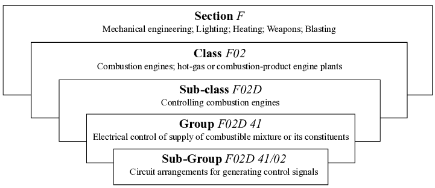
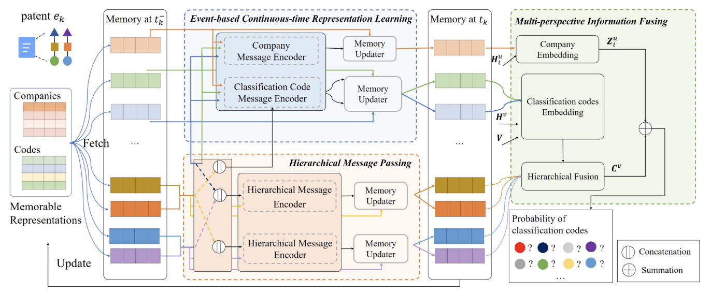
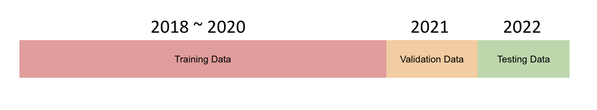

# SMM
## Teammates
王竣樺
梁致銓
曾繁斌
## Patent Crawler

## Data
You can find the complete data in this link: [link](https://drive.google.com/drive/folders/126X007qTLFmRhL6Fr0MCaCgDAZLMSM7F?usp=sharing)
- We use the data `merge_data.sqlite`  for training.
> [!TIP]
> The `merge_data.sqlite` should be put at `SMM` folder


Explanation of the data:
- **2-1-level.csv**: IPC Level mapping from 1 to 2.
- **3-2-level.csv**: IPC Level mapping from 2 to 3.
- **4-3-level.csv**: IPC Level mapping from 3 to 4.
- **5-4-level.csv**: IPC Level mapping from 4 to 5.
- **real-data.json**: Represent the company's patents in the year
> [!NOTE]
> we encode year 2018 as 0
> IPC Patent level example:
> 

## Final Project: Exploring Patent Trends in Taiwan with Event-based Graph Techniques
### Our Goal
Our project focuses on developing a patent prediction model specifically for forecasting Taiwan's future patent trends. Utilizing Event-based Graph techniques, this model analyzes historical patent data to identify emerging trends and patterns.
- **Data-Driven**: Uses real-world patent data (Taiwan) to identify trends.
- **Dynamic**: Adapts to changes in technology and innovation.
- **Predictive**: Forecasts areas likely to see growth in patent filings.
### Model FrameWork

> Framework of the proposed model. We just show the calculations of the patent classification codes and one of the related companies for simplicity.
### Code
We utilized the code from [EDGPAT](https://github.com/Hope-Rita/EDGPAT)

> [!WARNING]
> The Python env should be **Python 3.6**!


Required packages:
- [PyTorch 1.7.1](https://pytorch.org/)
- [tqdm](https://github.com/tqdm/tqdm)
- [numpy](https://github.com/numpy/numpy)
- [pandas](https://github.com/pandas-dev/pandas)
- [matplotlib](https://github.com/matplotlib/matplotlib)
### Preprocessing
Just run the `build_input.ipynb`


> We split the data into three parts: training, validation and testing by year.
### Training
Run the code:
```bash
sh train.sh
```
> [!NOTE]
> This code will ouptut the training result in `out.txt`

### Our Results
|Origin Paper Results|Our Results|
|--|--|
|<table> <thead> <tr><th></th><th>Recall</th><th>DNCG</th><th>PHR</th></tr> </thead> <tbody> <tr><td>Top-10</td><td>0.1175</td><td>0.1725</td><td>0.5491</td></tr> <tr><td>Top-20</td><td>0.1646</td><td>0.1742</td><td>0.6304</td></tr> <tr><td>Top-30</td><td>0.1868</td><td>0.1769</td><td>0.6612</td></tr> <tr><td>Top-40</td><td>0.2006</td><td>0.1769</td><td>0.6800</td></tr> </tbody> </table>|<table> <thead> <tr><th></th><th>Recall</th><th>DNCG</th><th>PHR</th></tr> </thead> <tbody> <tr><td>Top-10</td><td>0.1577</td><td>0.3395</td><td>0.8381</td></tr> <tr><td>Top-20</td><td>0.2349</td><td>0.3364</td><td>0.8995</td></tr> <tr><td>Top-30</td><td>0.2837</td><td>0.3401</td><td>0.9217</td></tr> <tr><td>Top-40</td><td>0.3150</td><td>0.3427</td><td>0.9321</td></tr> </tbody> </table>|
